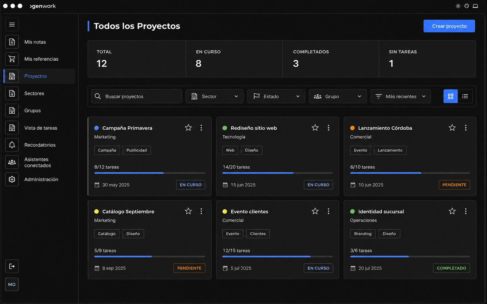
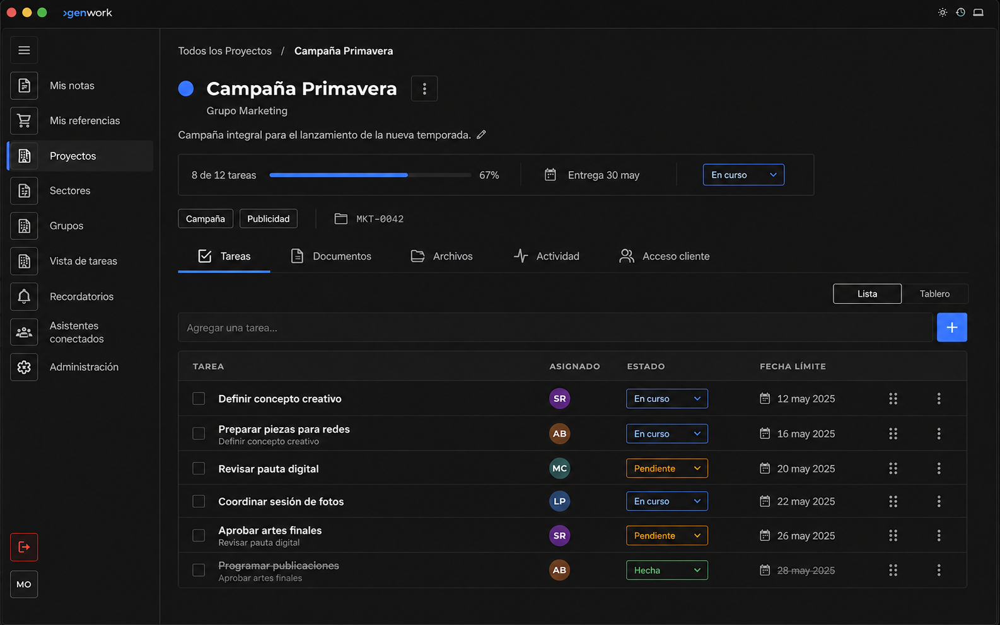
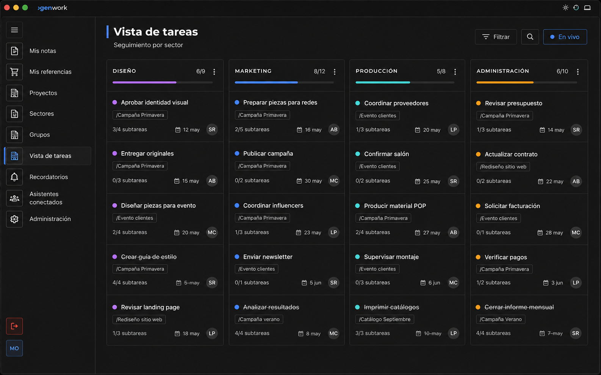

# Bocetos GenWork con identidad GenStock

Generados con la herramienta integrada `imagegen`, usando como referencias la captura POS y el golden de GenStock. Son dirección visual de alta fidelidad; no representan todavía una implementación verificada píxel por píxel.

## Dashboard

Prompt final resumido: UI mockup de escritorio 16:10 para “Todos los Proyectos”; shell y densidad de GenStock; paleta acromática `#0C0C0C/#151515/#1C1C1C/#262626/#2C2C2C`, azul `#5B7FFF` sólo en detalles de marca/interacción; Montserrat; sidebar Material outlined; stats, filtros y seis project cards; radios 4/6/8/12 por rol; sin gradientes, glassmorphism ni sombras en cards.

## Detalle de proyecto

Prompt final resumido: pantalla “Campaña Primavera” coherente con el dashboard; breadcrumb, estado y progreso, tags, código técnico, tabs Tareas/Documentos/Archivos/Actividad/Acceso cliente, selector Lista/Tablero y tabla densa de tareas de 44–48px; mismo shell, tokens, iconos Material outlined y marca azul.

## Vista global de tareas

Prompt final resumido: pantalla “Vista de tareas” coherente con las dos anteriores; cuatro paneles por sector con progreso y filas compactas, no tarjetas flotantes; etiquetas de proyecto, estados, fechas y responsables; misma superficie, geometría, tipografía, sidebar y lengüeta activa azul; sin estética SaaS redondeada.

## Restricciones comunes usadas

- Conservar arquitectura y textos en español de GenWork.
- Tomar de GenStock layout, densidad, jerarquía, bordes, superficies, Material icons y chrome de escritorio.
- Reemplazar todo verde de marca por azul GenWork.
- Mantener todas las superficies estrictamente acromáticas (`R=G=B`); ningún fondo azul o azul grisáceo.
- Evitar elementos de marketing, ilustraciones, exceso de aire, pills arbitrarias y cards con elevación.
- Mantener botones e inputs rectangulares; `4px` chips, `6px` controles, `8px` cards y `12px` sólo overlays.
